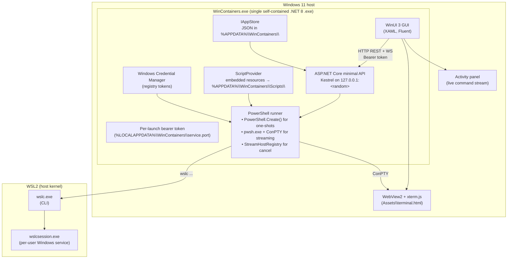

# WinContainers — v1 Plan

A complete, ready-to-execute plan built from the 25 strategic decisions we walked through. No open forks remain for v1.

---

## 1. Executive summary

**WinContainers** is a single-file Windows GUI that replaces Docker Desktop for **Linux containers on Windows 11**, built on Microsoft's new **WSLC (WSL Containers)** runtime (announced at Build 2026, currently in preview). The app is a WinUI 3 front-end hosting an in-process ASP.NET Core service; every action is implemented as a PowerShell script that calls `wslc.exe` and is shown to the user in a live Activity panel and a real ConPTY-backed PowerShell terminal tab. MIT-licensed, distributed via GitHub Releases + Velopack auto-update + WinGet. v1 ships in **6 weeks** and covers single-container workflows; Compose, Kubernetes, migration tools, auto-start, telemetry, and per-machine MSI are explicit v1.1+ deferrals.

---

## 2. Decisions log (the 25 answers)

| # | Decision | Choice |
|---|---|---|
| 1 | Stack language | .NET, single self-contained `.exe` |
| 2 | .NET UI framework | **WinUI 3** (Windows App SDK) |
| 3 | Process model | **Single .exe**, ASP.NET Core hosted in-process |
| 4 | Container runtime | **Microsoft WSLC** (WSL Containers, Build 2026 preview) |
| 5 | Windows containers | **Skipped in v1** (Linux containers only) |
| 6 | PowerShell visibility | **Activity panel + dedicated PowerShell terminal tab** |
| 7 | Runtime driver style | **PowerShell scripts calling `wslc.exe` CLI** |
| 8 | Runtime target | **Bet on WSLC preview, ship when it ships** |
| 9 | Compose | **None in v1, defer to v2** |
| 10 | v1 scope | **11 features, ~6 weeks** (no auto-start/auto-update/telemetry/migration) |
| 11 | Onboarding | **Detection + 4-card wizard + one-click install of WSL Preview (always latest)**, no auto-enroll in Windows Insider |
| 12 | Distribution | **GitHub Releases + Velopack + WinGet manifest** |
| 13 | Persistence | **JSON files in `%APPDATA%\WinContainers\`** + `IAppStore` interface; registry tokens in Windows Credential Manager |
| 14 | Script packaging | **Hybrid: embedded as `.NET` resources, extracted to `%APPDATA%` on first run, user can override** |
| 15 | License | **MIT, public GitHub from day one** |
| 16 | Code signing | **SignPath.io** (free for OSS, integrated with GitHub Actions) |
| 17 | GUI ↔ service transport | **HTTP/1.1 + WebSocket on `127.0.0.1:<random port>`, per-launch bearer token** |
| 18 | CI/CD | **GitHub Actions on `windows-latest` + xUnit/Playwright/Verify pyramid** |
| 19 | PowerShell runner | **In-proc `PowerShell.Create()` for one-shots + `pwsh.exe` child processes for streaming, with `StreamHostRegistry`** |
| 20 | PowerShell terminal | **Real `pwsh.exe` via ConPTY + xterm.js in embedded WebView2** |
| 21 | Dashboard data flow | **Poll `wslc container ps` every 2 s, no per-container CPU/mem in v1** (upgrade path behind `IContainerStateProvider` interface) |
| 22 | App name | **WinContainers** (positioning: "WSL Containers GUI for Windows, Linux containers only") |
| 23 | Install scope | **Per-user only in v1** (Velopack `InstallScope.PerUser`); MSI deferred to v1.1 |
| 24 | Repo layout | **Multi-project solution** (`src/WinContainers.{Core,Service,Scripts,App}` + `tests/WinContainers.Tests.{Unit,Integration,Playwright}`) |
| 25 | Registry auth | **Hybrid: Settings → Registries (eager, on startup) + lazy dialog on `unauthorized` pull** |

---

## 3. Architecture



**Key properties of the architecture:**

- **One process, one port.** WinContainers.exe is the GUI. At startup, `App.OnLaunched` builds an ASP.NET Core `WebApplication`, binds Kestrel to `127.0.0.1:0` (random free port), writes the port + 128-bit token to `%LOCALAPPDATA%\WinContainers\service.{port,token}`, and starts the host in a `Task.Run`. The WinUI 3 `HttpClient` reads the file and calls the API.
- **PowerShell is the only side-effecting layer.** All WSLC interactions are `.ps1` scripts. The service never spawns `wslc.exe` directly. Scripts live in `src/WinContainers.Scripts/*.ps1` and are embedded into the App project as resources; on first run, the `ScriptProvider` materializes them to `%APPDATA%\WinContainers\Scripts\` so power users can read/override.
- **Two PowerShell execution paths.** One-shots (list/start/stop/pull/inspect/create) use `System.Management.Automation.PowerShell.Create()` in-proc for sub-50 ms latency. Streaming flows (logs, stats, events, the ConPTY terminal) spawn `pwsh.exe` as a child process, registered in `StreamHostRegistry` for cancellation.
- **ConPTY terminal.** The PowerShell tab is a real `pwsh.exe` with a Windows pseudo-console attached, output forwarded over `ws://127.0.0.1:<port>/ws/terminal`, rendered by xterm.js in an embedded WebView2 control (`Assets\terminal.html`). The Activity panel shows the *script* calls; the terminal shows the *interactive* shell.

---

## 4. Tech stack (locked)

| Layer | Technology | Why |
|---|---|---|
| Language | C# 12, .NET 8 | Required by WinUI 3 + Windows App SDK 1.5+ |
| GUI | WinUI 3 (Windows App SDK) via `Microsoft.WindowsAppSDK` 1.5+ | Modern Fluent UI, single-project packaging, WebView2 native |
| Local service | ASP.NET Core 8 minimal API + Kestrel | In-proc hosting, `WebApplication.CreateBuilder()` |
| Transport | HTTP/1.1 + WebSocket on loopback, per-launch bearer token | Industry standard, debuggable with curl |
| Terminal | ConPTY via `Pty.Net` (NuGet) + xterm.js in WebView2 | Real PTY, full ANSI |
| PowerShell hosting | `Microsoft.PowerShell.SDK` 7.4+ | In-proc runspaces for one-shots |
| Container runtime | `wslc.exe` (Microsoft WSL Containers preview) | First-party Microsoft runtime, future-proof |
| Container distro | None shipped (WSLC uses WSL's host kernel) | One less thing to install |
| Persistence | `System.Text.Json` + `IAppStore` interface | Zero deps, easy to migrate to SQLite in v2 |
| Secrets | Windows Credential Manager via `CredentialManagement` NuGet | No secrets on disk |
| Auto-update | Velopack (`vpk` CLI) | Modern Squirrel successor, .NET-native, code-sign-friendly |
| Code signing | SignPath.io (free for OSS) | Cert, GitHub Actions integration |
| Distribution | GitHub Releases + WinGet community manifest | Free, no MS Store cut |
| CI/CD | GitHub Actions, `windows-latest` runner | Free for OSS, integrated with Releases |
| Unit tests | xUnit + FluentAssertions + NSubstitute | Standard .NET |
| Integration tests | xUnit, `Skip = wslcMissing` trait | Won't fail when CI lacks WSLC |
| UI tests | Playwright for the WebView2 terminal pane | Modern, headless, easy CI |
| Logging | Serilog → `%LOCALAPPDATA%\WinContainers\logs\app-YYYYMMDD.log` | Structured, rolling |
| Telemetry | **None in v1** (deferred) | Opt-in is the eventual model |

---

## 5. Repo layout

```
WinContainers/                              ← GitHub repo
├── src/
│   ├── WinContainers.Core/                 ← Models, IRuntimeDriver, IContainerStateProvider, IAppStore
│   ├── WinContainers.Service/              ← ASP.NET Core minimal API, PSRunner, StreamHostRegistry
│   ├── WinContainers.Scripts/              ← *.ps1 + ScriptManifest.json (embedded resources in App)
│   └── WinContainers.App/                  ← WinUI 3 project → WinContainers.exe
├── tests/
│   ├── WinContainers.Tests.Unit/
│   ├── WinContainers.Tests.Integration/    ← [Trait("wslc", "required")] with skip-when-missing
│   └── WinContainers.Tests.Playwright/     ← terminal pane UI
├── docs/
│   ├── architecture.md
│   ├── api-contract.md                     ← OpenAPI 3.1
│   ├── sprint-plan.md
│   ├── security-checklist.md
│   ├── ui-mockups/                         ← Figma/SVG of Dashboard, Images, Containers, ...
│   └── screenshots/
├── .github/
│   ├── workflows/{ci,release,codeql}.yml
│   └── dependabot.yml
├── assets/
│   ├── icon.ico / icon.png / icon.svg
│   └── terminal.html                      ← xterm.js + WebSocket client (loaded by WebView2)
├── samples/                                ← Example compose-style single-container runs
├── SignPath.json
├── Directory.Build.props                   ← shared LangVersion, Nullable, TreatWarningsAsErrors
├── Directory.Packages.props                ← centralized NuGet versions
├── .editorconfig
├── .gitignore
├── .gitattributes
├── LICENSE                                 ← MIT
├── README.md
├── CONTRIBUTING.md
├── CHANGELOG.md
└── WinContainers.sln
```

---

## 6. v1 feature inventory (11 features, ordered by dependency)

| # | Feature | Notes |
|---|---|---|
| F1 | Onboarding wizard (4 prereq cards) | WSL, virtualization, Windows Insider, WSL Preview |
| F2 | Dashboard (container list, status, actions) | Poll `wslc container ps` every 2 s, status badges |
| F3 | Container start / stop / restart / delete | One-shots via `PowerShell.Create()` |
| F4 | Image list + pull + delete + inspect | `wslc image ls`, `wslc image pull`, `wslc image rm` |
| F5 | Container exec / terminal entry-point button | One-shot, returns a `StreamHost` ID |
| F6 | Logs viewer (live tail + 500-line history) | `wslc logs` as a streaming child process |
| F7 | Volume management (list, create, inspect, delete) | `wslc volume ...` |
| F8 | Network management (list, create, inspect, delete) | `wslc network ...` |
| F9 | Registry auth (Settings → Registries + lazy dialog) | Credential Manager + `wslc login` |
| F10 | Settings screen (theme, terminal font size, registry list, startup) | `IAppStore` JSON |
| F11 | Activity panel + PowerShell terminal tab (ConPTY + xterm.js) | The headline transparency feature |

F11 is the **single biggest sprint** (Sprint 3). Everything else is "just" wiring PowerShell scripts to buttons.

---

## 7. Sprint plan (6 × 1 week)

### Sprint 1 — Foundation
- Repo scaffold, `.sln`, `Directory.Build.props`, `Directory.Packages.props`, CI workflow
- `WinContainers.Core` (empty interfaces, `IAppStore`, models)
- `WinContainers.Service` (empty `WebApplication`, Kestrel loopback binding, port/token file)
- `WinContainers.Scripts` (first 6 scripts: `Get-Container.ps1`, `Start-Container.ps1`, `Stop-Container.ps1`, `Remove-Container.ps1`, `Get-Image.ps1`, `Pull-Image.ps1`)
- `WinContainers.App` (WinUI 3 project, `App.xaml`, `MainWindow.xaml`, navigation shell, placeholder pages)
- `ScriptProvider` implementation: extract embedded resources to `%APPDATA%` on first run
- `StreamHostRegistry` skeleton
- **Demo:** App launches, dashboard shows "Hello from WinContainers" placeholder, scripts are visible in `%APPDATA%\WinContainers\Scripts\`

### Sprint 2 — Containers + Images (F2, F3, F4)
- F2 Dashboard: `IContainerStateProvider` polls `wslc container ps --format json` every 2 s, WinUI 3 `ItemsRepeater` with virtualized container card
- F3 Start/Stop/Restart/Delete: action buttons → `POST /api/containers/{id}/start|stop|...`
- F4 Images page: list + pull + delete
- F4 Pull dialog: image name field, error path surfaces lazy registry login (stub for Sprint 4)
- **Demo:** Pull `nginx:alpine`, start it on port 8080, see it in the dashboard, hit `localhost:8080`, stop it, delete it. Activity panel shows every `wslc` call.

### Sprint 3 — Terminal (F11) + Logs (F6) + Exec (F5)
- ConPTY integration: `Pty.Net` setup, `pwsh.exe` spawn with pseudo-console, ResizeObserver
- WebView2 + xterm.js: `Assets\terminal.html` with `@xterm/xterm`, `@xterm/addon-fit`, `@xterm/addon-web-links`
- WebSocket bridge `/ws/terminal` multiplexing terminal I/O
- PowerShell profile in the terminal: dot-source `%APPDATA%\WinContainers\Scripts\WinContainers.psm1` (a small module manifest that re-exports our scripts as functions)
- F6 Logs: `wslc logs -f` as a streaming child process in `StreamHostRegistry`; tail view with virtualized lines
- F5 Exec: button on container card opens a new terminal pane with `wslc exec -it <id> pwsh` (or `bash`)
- **Demo:** Click a running container, hit "Open in terminal," get a real pwsh session inside the container, fully ANSI-colored, resize works, copy/paste works. Logs stream in the Logs pane.

### Sprint 4 — Volumes, Networks, Registries (F7, F8, F9)
- F7 Volume management pages
- F8 Network management pages
- F9 Settings → Registries: add/edit/remove; on app start, iterate and call `wslc login <registry>` using tokens from Credential Manager
- F9 Lazy dialog: catch `unauthorized` from `wslc image pull`, show modal, store, retry
- "Run container" dialog (used by Sprint 2 and onward, polished here): name, image (with autocomplete from `wslc image ls`), ports, env, mounts, network, restart policy, command
- **Demo:** Create a volume, attach it to a running container, create a custom bridge network, run a second container on it, pull a private image from a test registry, registry auth UI saves and reapplies credentials across restarts.

### Sprint 5 — Installer, Signing, Onboarding, Settings (F1, F10)
- F1 Onboarding wizard: 4 cards (WSL, Virt, Insider, WSL Preview), "Install WSL Preview" button via `ms-windows-store://pdp/?ProductId=9P9TQF7MRM4R` URI + `winget install Microsoft.WSLPreview`, "Verify installation" runs a hello-world container
- F10 Settings screen: theme (system/light/dark), terminal font, terminal history size, default registry, startup behavior
- Velopack integration: `vpk pack` produces `WinContainers-1.0.0.exe` (installer) + delta updates
- SignPath.io integration: signtool step in `release.yml`
- WinGet manifest: `winget-pkgs` PR via `vedantmgoyal9/winget-releaser` action
- **Demo:** Fresh Windows 11 VM, download `WinContainers-1.0.0.exe`, run it, walk the wizard, install WSL Preview with one click, verify, app boots into the dashboard. Quit the VM, download `WinContainers-1.0.1.exe`, run, auto-updates. `winget install WinContainers` from a clean machine also works.

### Sprint 6 — Polish, docs, demo
- Performance pass: 2 s polling without UI jank, WebView2 GPU acceleration on, log tail debounce
- Accessibility: keyboard navigation for all primary actions, screen reader labels for table cards
- Error UX: standardize the wslc error envelope into a toast + Activity entry
- Docs: `README.md` with GIFs, `docs/architecture.md` final pass, `docs/security-checklist.md` filled in, "Migrating from Docker Desktop" doc (deferred feature, but document the gap)
- Demo video: 5-minute walkthrough recorded
- **Demo:** The release. Public GitHub release `v1.0.0` with all 11 features, signed installer, WinGet live.

---

## 8. API contract (in-process HTTP/WS)

All endpoints under `http://127.0.0.1:<port>/api/`. All requests require `Authorization: Bearer <token>` from `service.token`.

### REST (JSON over HTTP/1.1)

| Method | Path | Purpose |
|---|---|---|
| `GET` | `/api/containers` | List containers (snapshot from poll) |
| `POST` | `/api/containers/{id}/start` | Start container |
| `POST` | `/api/containers/{id}/stop` | Stop container |
| `POST` | `/api/containers/{id}/restart` | Restart container |
| `DELETE` | `/api/containers/{id}` | Remove container |
| `POST` | `/api/containers/{id}/exec` | Spawn exec session, returns `{ "streamId": "..." }` |
| `GET` | `/api/containers/{id}/logs?tail=500` | Get last N log lines |
| `GET` | `/api/containers/{id}/logs/stream` | Open WS for live log tail → returns `streamId` |
| `GET` | `/api/images` | List images |
| `POST` | `/api/images/pull` | `{"image":"nginx:latest"}` → spawns stream, returns `streamId` |
| `DELETE` | `/api/images/{id}` | Remove image |
| `GET` | `/api/volumes` | List volumes |
| `POST` | `/api/volumes` | `{"name":"..."}` |
| `DELETE` | `/api/volumes/{name}` | Remove |
| `GET` | `/api/networks` | List networks |
| `POST` | `/api/networks` | `{"name":"..."}` |
| `DELETE` | `/api/networks/{name}` | Remove |
| `GET` | `/api/registries` | List configured registries (metadata only) |
| `POST` | `/api/registries` | Add registry (stores secret in Credential Manager) |
| `DELETE` | `/api/registries/{host}` | Remove registry |
| `GET` | `/api/settings` | Get app settings |
| `PUT` | `/api/settings` | Update app settings |
| `GET` | `/api/health` | `{ "wslcOk": true, "wslcVersion": "...", "appVersion": "..." }` |

### WebSocket

| Path | Direction | Messages |
|---|---|---|
| `/ws/events` | server → client | `{ "op": "container.snapshot", "data": [...] }` every 2 s; `{ "op": "container.event", "data": {...} }` on detected state change |
| `/ws/terminal` | bidirectional | `{ "op":"terminal.in", "data":"..." }` / `{ "op":"terminal.out", "data":"..." }` / `{ "op":"terminal.resize", "cols":N, "rows":N }` |
| `/ws/stream/{streamId}` | server → client | `{ "op":"stream.line", "data":"..." }` for log tails and pull progress; `{ "op":"stream.closed", "exitCode":N }` on end |

---

## 9. PowerShell script manifest (`src/WinContainers.Scripts/ScriptManifest.json`)

Each entry has `{ "name": "Get-Container", "type": "one-shot", "command": "wslc container ps --format json", "timeoutMs": 30000 }`. Streaming scripts add `"type": "stream"`.

```json
{
  "scripts": [
    { "name": "Get-Container",            "type": "one-shot", "command": "wslc container ps --format json",                 "timeoutMs": 30000 },
    { "name": "Start-Container",          "type": "one-shot", "command": "wslc container start {id}",                       "timeoutMs": 30000 },
    { "name": "Stop-Container",           "type": "one-shot", "command": "wslc container stop {id}",                        "timeoutMs": 30000 },
    { "name": "Restart-Container",        "type": "one-shot", "command": "wslc container restart {id}",                     "timeoutMs": 30000 },
    { "name": "Remove-Container",         "type": "one-shot", "command": "wslc container rm {id}",                          "timeoutMs": 30000 },
    { "name": "Get-Image",                "type": "one-shot", "command": "wslc image ls --format json",                     "timeoutMs": 30000 },
    { "name": "Pull-Image",               "type": "stream",   "command": "wslc image pull {image}",                         "timeoutMs": 1800000 },
    { "name": "Remove-Image",             "type": "one-shot", "command": "wslc image rm {id}",                              "timeoutMs": 30000 },
    { "name": "Get-Volume",               "type": "one-shot", "command": "wslc volume ls --format json",                    "timeoutMs": 30000 },
    { "name": "New-Volume",               "type": "one-shot", "command": "wslc volume create {name}",                       "timeoutMs": 30000 },
    { "name": "Remove-Volume",            "type": "one-shot", "command": "wslc volume rm {name}",                           "timeoutMs": 30000 },
    { "name": "Get-Network",              "type": "one-shot", "command": "wslc network ls --format json",                   "timeoutMs": 30000 },
    { "name": "New-Network",              "type": "one-shot", "command": "wslc network create {name}",                      "timeoutMs": 30000 },
    { "name": "Remove-Network",           "type": "one-shot", "command": "wslc network rm {name}",                          "timeoutMs": 30000 },
    { "name": "Get-ContainerLogs",        "type": "one-shot", "command": "wslc logs --tail {tail} {id}",                    "timeoutMs": 30000 },
    { "name": "Start-ContainerLogsStream","type": "stream",   "command": "wslc logs -f {id}",                               "timeoutMs": 0 },
    { "name": "Exec-Container",           "type": "stream",   "command": "wslc exec -it {id} pwsh",                         "timeoutMs": 0 },
    { "name": "Login-Registry",           "type": "one-shot", "command": "wslc login {host} --username {u} --password-stdin","timeoutMs": 30000 },
    { "name": "Verify-Wslc",              "type": "one-shot", "command": "wslc --version",                                  "timeoutMs": 10000 }
  ],
  "terminal": {
    "moduleName": "WinContainers",
    "moduleManifest": "WinContainers.psd1",
    "profile": "%APPDATA%\\WinContainers\\Scripts\\WinContainers.psm1"
  }
}
```

---

## 10. CI/CD pipeline

| Workflow | Trigger | Steps |
|---|---|---|
| `ci.yml` | every PR + push to `main` | checkout → setup-dotnet@v4 (8.x) → restore → `dotnet build -c Release` → `dotnet test` (unit) → `dotnet test --filter Trait=wslc` (integration, skips cleanly) → `dotnet test` (Playwright, terminal pane) → `dotnet format --verify-no-changes` |
| `release.yml` | tag push `v*.*.*` | ci.yml steps → `dotnet publish` → `vpk pack` → SignPath submit → `gh release create` with `WinContainers-Setup.exe` + delta + portable `.exe` → `vedantmgoyal9/winget-releaser` to PR `microsoft/winget-pkgs` |
| `codeql.yml` | weekly + every PR | `github/codeql-action` C# analysis |
| `dependabot.yml` | weekly | NuGet, GitHub Actions |

`SignPath.json` declares the release signing policy and the project name. The release workflow submits `vpk`-produced binaries to SignPath, which signs with the cert and returns the signed artifact for upload.

---

## 11. Security checklist (v1 commitments)

- [x] Bearer token in `Authorization` header; rotated per app launch
- [x] Token file ACL'd to current user only (Windows DACL on `%LOCALAPPDATA%`)
- [x] Kestrel bound to `IPAddress.Loopback` only — not reachable from other machines
- [x] No secrets in `settings.json`; all tokens in Windows Credential Manager
- [x] PowerShell scripts embedded as resources; integrity verified by .NET assembly strong-name
- [x] Scripts extracted to a user-writable, user-owned folder; user can override
- [x] `dotnet publish` flags: `PublishSingleFile`, `SelfContained`, `PublishReadyToRun`, `EnableCompressionInSingleFile`, `IncludeNativeLibrariesForSelfExtract`, `DebugType=embedded`
- [x] SignPath.io signing of all released binaries
- [x] `Velopack` update channel verifies signatures before applying deltas
- [x] No telemetry in v1 (zero data leaves the machine)
- [x] No UAC prompt for normal use; admin elevation only when explicitly required (not in v1)
- [x] Audit log: every `wslc` call captured in the Activity panel + Serilog
- [x] Dependencies pinned via `Directory.Packages.props`; Dependabot weekly
- [x] CodeQL weekly scan; no high-severity findings required to merge

---

## 12. Risks and open questions

| Risk | Impact | Mitigation |
|---|---|---|
| WSLC preview slips past Build 2026 → public preview window | Whole product blocked | We can ship a `containerd+nerdctl` `IRuntimeDriver` behind the same interface (no code change in GUI), or wait |
| WSLC C# SDK ships and changes the recommended integration | Some refactor | We can swap to SDK calls without changing `IRuntimeDriver` contract |
| WSLC gains `events`/`stats` mid-sprint | We pay down the dashboard debt | v1.1 swap behind `IContainerStateProvider` |
| WinUI 3 packaging friction (single .exe + MSIX-free) | Sprint 5 risk | Use Velopack's `wpf`-style flow; tested in WinUI 3 sample |
| SignPath.io approval for new OSS project | Could delay v1.0.0 | Apply at end of Sprint 4; keep self-signed dev builds in parallel |
| ConPTY behavior across Windows 11 builds (22H2 vs 23H2 vs 24H2) | Terminal might glitch on some builds | `Pty.Net` is maintained; pin to a known-good version; integration test on 23H2 |
| Velopack update flow requires a specific .exe layout | Could break the "single .exe" promise | Velopack's `Portable` install mode preserves the single-file story; verify in Sprint 5 |
| "WinContainers" naming confusion with Microsoft's "Windows Containers" feature | Marketing/positioning | Subtitle everywhere: "WSL Containers GUI for Windows — Linux containers" |

---

## 13. Glossary

- **WSLC** — WSL Containers, Microsoft's new first-party Linux container runtime announced at Build 2026, ships in a future WSL update, exposes `wslc.exe` CLI and a C# SDK.
- **`wslc.exe`** — The CLI for WSLC, lives on PATH after installing the WSL Preview package.
- **`wslcsession.exe`** — The per-user Windows service that hosts the WSLC runtime.
- **ConPTY** — Windows pseudo-console API (Win10+), gives proper PTY semantics to child processes.
- **WinUI 3** — Modern Windows UI framework from the Windows App SDK; Fluent design.
- **Windows App SDK** — The SDK that ships WinUI 3, WebView2, and packaging tooling.
- **Velopack** — Modern Squirrel.Windows successor for .NET auto-update; .NET-native.
- **SignPath.io** — Free code signing for OSS projects, integrates with GitHub Actions.
- **`IRuntimeDriver`** — Our abstraction over WSLC; future-proofs against runtime changes.
- **`IContainerStateProvider`** — Our abstraction for live container state; future-proofs against WSLC's missing `events`/`stats`.
- **`StreamHostRegistry`** — Our service that tracks long-lived `pwsh.exe` child processes for logs/exec/terminal, supports cancellation.

---

## 14. First 5 things to do after exiting plan mode

1. Create the GitHub repo `WinContainers` (placeholder name) and push an empty commit
2. Run `dotnet new sln` and `dotnet new winui3 -n WinContainers.App` to scaffold the WinUI 3 project, then add `WinContainers.Core`, `WinContainers.Service`, `WinContainers.Scripts`, three test projects
3. Wire `Directory.Build.props` and `Directory.Packages.props` with `Microsoft.WindowsAppSDK` 1.5+, `Microsoft.PowerShell.SDK` 7.4+, `Pty.Net`, `Serilog.AspNetCore`, `xunit`, `FluentAssertions`, `NSubstitute`, `Playwright`
4. Apply for SignPath.io OSS project approval (1–2 week lead time, do it now)
5. File an issue titled "WSLC public preview availability" to track Microsoft's release date
